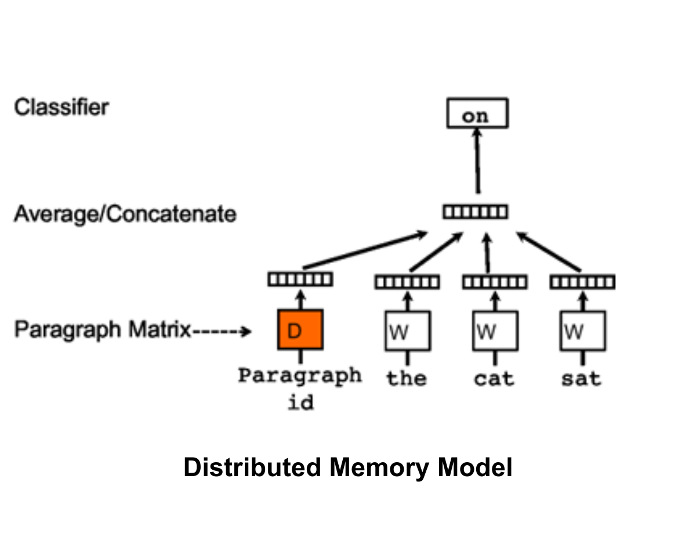
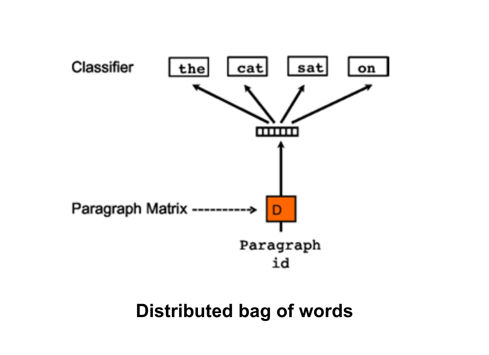

# Doc2Vec: Document Embedding

Welcome to the Doc2Vec repository! In this project, we explore document embedding techniques to capture the semantic meaning of entire documents or paragraphs. Document embeddings are valuable for various tasks such as classification, clustering, or similarity search.

## What is Doc2Vec?

Doc2Vec is a powerful technique that maps each document or paragraph to a fixed-length vector in a high-dimensional space. These vectors are learned in such a way that similar documents are mapped to nearby points in the vector space.

### Types of Doc2Vec

There are two main variants of the Doc2Vec approach:

1. **Distributed Memory (DM)**:
   - An extension of the popular Word2Vec model.
   - Learns fixed-length vector representations for text data by considering context.
   - Consists of a neural network with projection and output layers.
   - Considers both word order and document context for capturing semantic meaning.

   

2. **Distributed Bag of Words (DBOW)**:
   - A simpler version of Doc2Vec focusing on word distribution.
   - Assigns a unique vector representation to each document without separate word vectors.
   - Treats documents as a bag of words, ignoring word order.
   - Faster to train but potentially less powerful in capturing document meaning compared to DM.

   

### Main Difference between DM and DBOW

- DM considers both word order and document context, making it more powerful for capturing semantic meaning.
- DBOW is simpler and faster to train, focusing on capturing distributional properties of words in a corpus.

For a gentle introduction to Doc2Vec, check out this informative [Medium article](https://medium.com/wisio/a-gentle-introduction-to-doc2vec-db3e8c0cce5e)

## Getting Started

To explore Doc2Vec and its applications:

1. Clone the repository:

   ```bash
   git clone https://github.com/chiragb254/doc2vec.git
   ```

2. Dive into the provided code examples and notebooks to understand Doc2Vec in action.

## Connect with Me

- **LinkedIn**: [Chirag B.](www.linkedin.com/in/chiragb254)
- **Email**: <devchirag27@gmail.com>

Contributions are welcome! Whether you want to suggest improvements, fix bugs, or add more examples, your contributions will help enhance this project.

Let's unlock the potential of document embeddings with Doc2Vec together! 🚀✨

-----